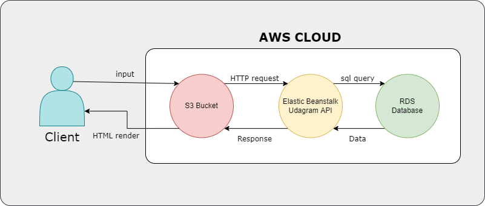
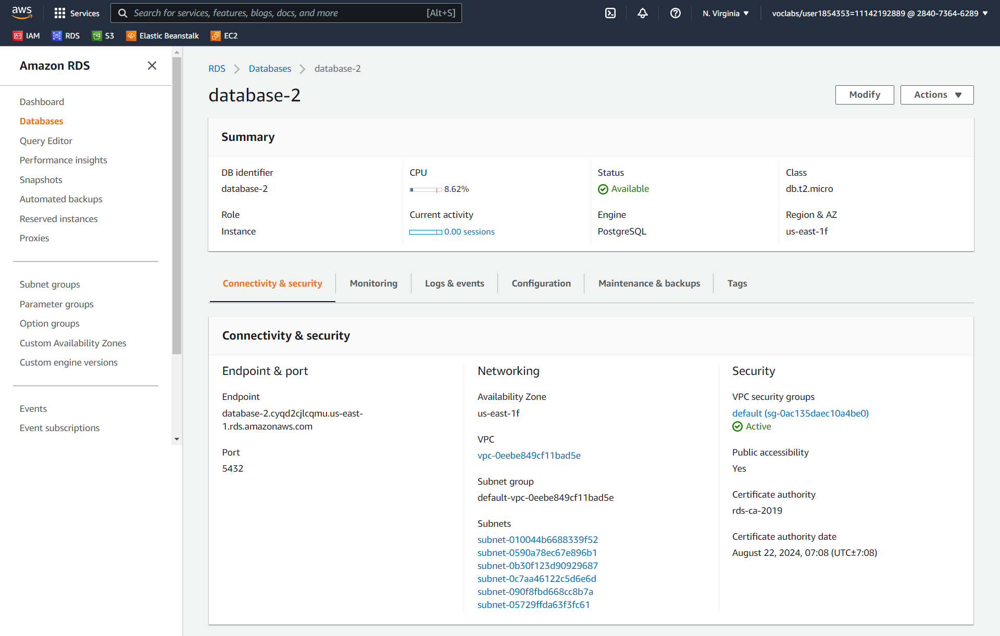

# Infastructure

- ## web server (AWS elastic beanstalk env)
  - ### a nodejs env on the aws eb to run the backend of our app
    
- ## frontend (AWS S3 bucket)
  - ### an aws s3 bucket to contain our frontend side files
    
- ## database (AWS RDS)
  - ### a database on the aws RDS service to serve our databse for the app
    
