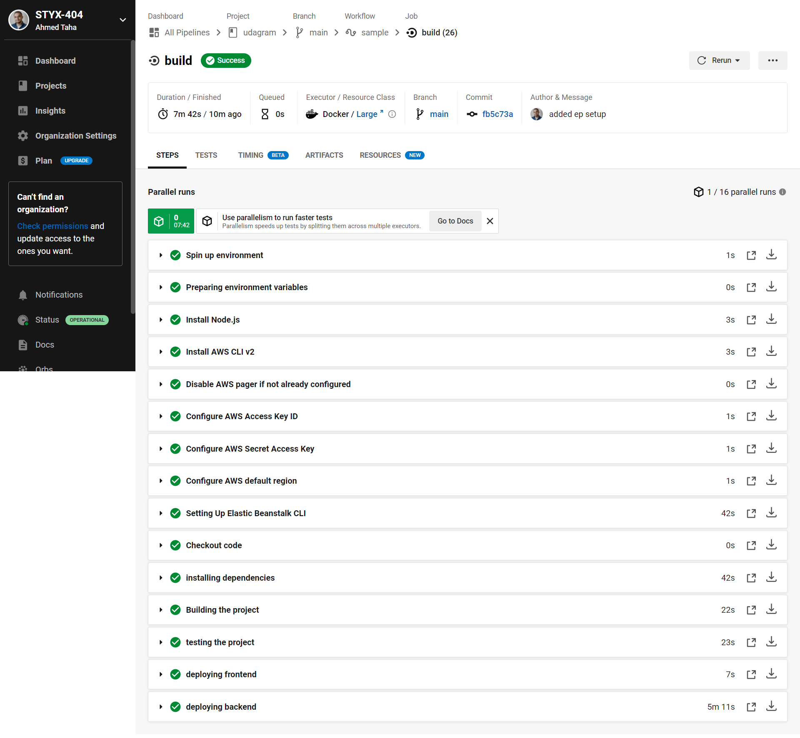

### The Project Pipeline

1. Push the new code to the github repo on the main branch
2. the CircleCi service automatically detect the changed code
3. the CircleCi service perform the pre-defined pipeline
   - prepare the environment variables
   - install the predefined node version on the server
   - install aws cli
   - assign the defined aws credintials and region
   - install and setup elastic beanstalk CLI
   - install the app dependancies
   - build the app (front-end and back-end)
   - run test scripts for the frontend and backend
   - deploy the frontend to aws s3 bucket
   - deploy the backend to aws elastic beanstalk

